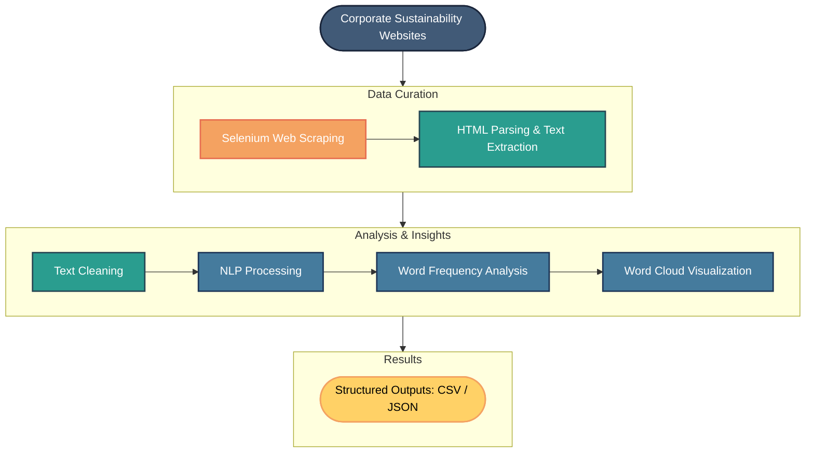
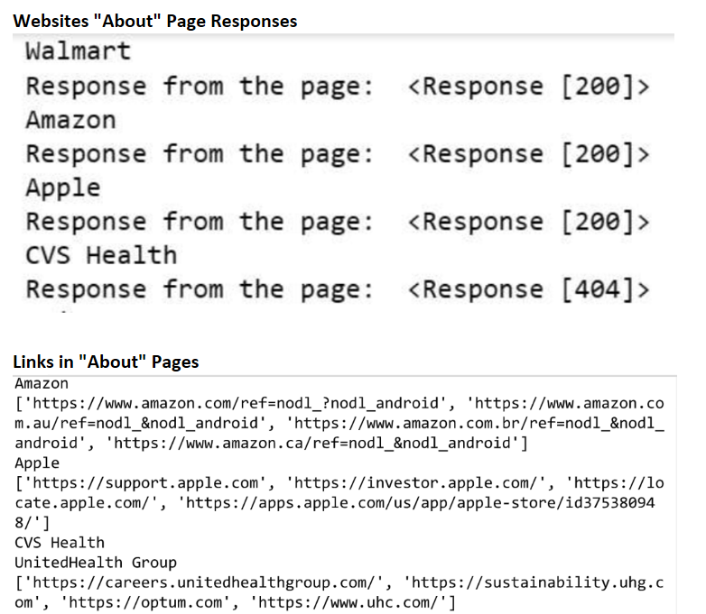
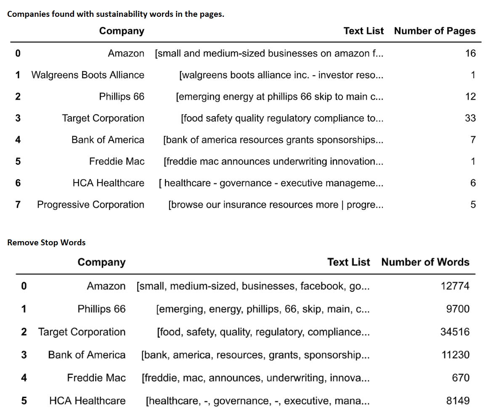
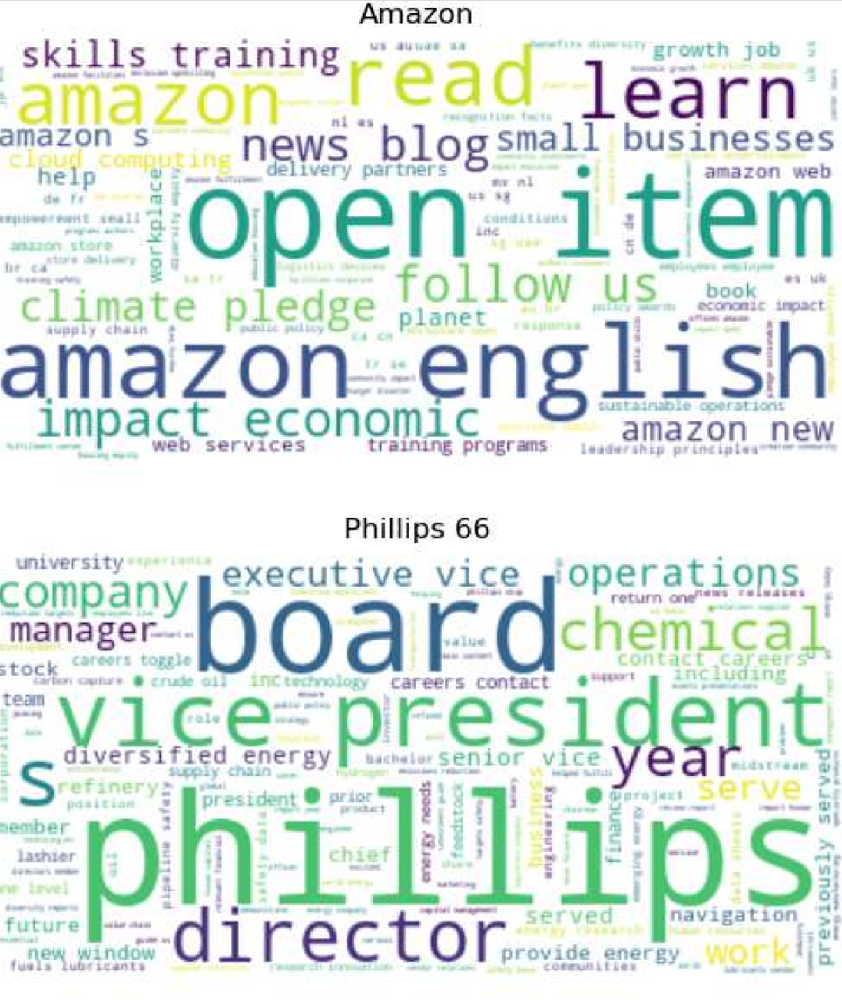
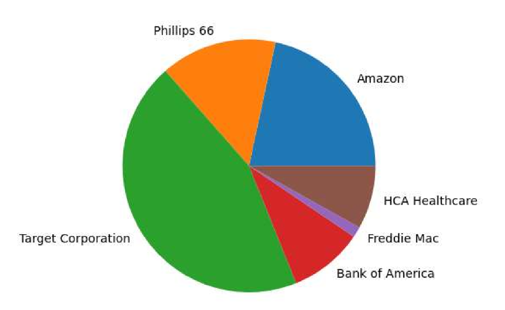
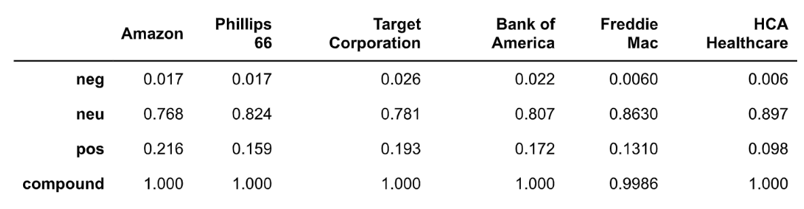

# Sustainability Data Collection & NLP Pipeline


> An end-to-end data collection and Natural Language Processing (NLP) pipeline that automatically gathers sustainability-related information from major U.S. companies, cleans and analyzes the collected text, and generates visual insights through word frequency analysis and word clouds.

<p align="center">

</p>

---

## Project Overview

Understanding how organizations communicate their sustainability initiatives requires collecting information from many different sources and transforming unstructured web content into analyzable data.

This project automates that workflow by combining:

- Automated web scraping
- Data collection and cleaning
- Text preprocessing
- Natural Language Processing (NLP)
- Exploratory text visualization

The resulting pipeline demonstrates how raw web content can be transformed into structured datasets suitable for sustainability analysis and future machine learning applications.

---

## Objectives

- Collect sustainability information from publicly available corporate websites
- Automate navigation and data extraction
- Clean and normalize collected text
- Extract sustainability-related terminology
- Generate visual summaries of the collected corpus
- Export processed data for further analysis

---

## Pipeline Overview



---

## Technologies Used

| Category | Tools |
|-----------|------|
| Language | Python |
| Web Scraping | Selenium, BeautifulSoup, Requests |
| Data Processing | Pandas, NumPy |
| NLP | NLTK |
| Visualization | Matplotlib, WordCloud |
| Notebook | Jupyter Notebook |

---

## Project Structure

```
.
├── sustainabilityProject.ipynb
├── requirements.txt
├── report/
│   └── ProjectPDF.pdf
├── data/
│   ├── CleanText.csv
│   ├── CleanTextJson.json
│   └── ...
├── images/
│   ├── repo_images/
│   │   ├── hero_pipeline.png
│   │   ├── data_extraction.png
│   │   ├── text_cleaning.png
│   │   ├── stop_words_rem.png
│   │   ├── number_of_pages.png
│   │   ├── sentiment_analysis.png
│   │   └── amazon_vs_phillips.png
│   └── ...
└── README.md
```

---

## Methodology

### 1. Website Collection

The pipeline automatically visits company sustainability pages using Selenium and extracts relevant HTML content.

---

### 2. Data Extraction

Information is parsed using BeautifulSoup to isolate meaningful textual content while removing unnecessary HTML elements.

<p align="center">

<br>
<em>Website responses and extracted links used to locate pages related to sustainability.</em>
</p>

---

### 3. Text Cleaning

Collected documents undergo preprocessing including:

- Lowercase conversion
- Punctuation removal
- Stopword removal
- Tokenization
- Basic normalization

This creates a clean corpus suitable for analysis.

<p align="center">

<br>
<em>After filtering pages, stop words are removed so the remaining tokens better support NLP analysis.</em>
</p>

---

### 4. Natural Language Processing

The cleaned text is analyzed to identify frequently occurring sustainability-related terms.

Examples include:

- sustainability
- energy
- climate
- emissions
- renewable
- community
- recycling
- environment

---

### 5. Visualization

The processed corpus is visualized through:

- Word frequency distributions
- Word clouds
- Summary statistics

These visualizations provide a quick understanding of common sustainability themes across companies.

<p align="center">

<br>
<em>Word clouds compare the dominant terms extracted from Amazon and Phillips 66 pages.</em>
</p>

---

## Results

The project successfully demonstrates an end-to-end NLP workflow capable of:

- Automatically collecting sustainability-related web content
- Cleaning large amounts of unstructured text
- Extracting meaningful keywords
- Producing visual summaries
- Exporting reusable datasets

<p align="center">

<br>
<em>Detected sustainability-related pages varied by company, with Target Corporation and Amazon contributing many of the extracted pages.</em>
</p>

<p align="center">

<br>
<em>VADER sentiment scores show that the extracted corporate sustainability text is mostly neutral, with positive language present across the analyzed companies.</em>
</p>

---

## Example Outputs

- Sustainability dataset (CSV)
- Structured JSON exports
- Word cloud visualizations
- Word frequency charts
- Page-count and sentiment-analysis summaries

---

## Skills Demonstrated

- Web Scraping
- Automated Data Collection
- Data Cleaning
- Natural Language Processing
- Exploratory Data Analysis
- Text Mining
- Python Automation
- Data Visualization

---

## Challenges

Some corporate websites required dynamic rendering, making traditional HTTP requests insufficient.

Using Selenium allowed automated browser interaction while BeautifulSoup provided efficient HTML parsing after page rendering.

---

## Future Improvements

- Transformer-based NLP models
- Named Entity Recognition (NER)
- Topic Modeling (LDA)
- Sentiment Analysis
- Interactive dashboards
- Scheduled automated data collection
- Cloud deployment

---

## Repository Contents

- Source notebook
- Project report
- Generated datasets
- Supporting visualizations

---

## Installation
Python version
```
Python 3.10+
```
Repository cloning and installation
```bash
# Clone repository
git clone https://github.com/yourusername/sustainability-nlp-pipeline.git

# Select project directory
cd sustainability-nlp-pipeline

# Create a virtual environment
python -m venv venv

# Activate environment
# macOS / Linux
source venv/bin/activate
# Windows
venv\Scripts\activate

# Install dependencies
pip install -r requirements.txt
```

NLTK data may need to be downloaded once:
```
import nltk

nltk.download("punkt")
nltk.download("stopwords")
```
---

## Notes

This project was originally developed as an academic data science project.

Because the data is collected from publicly available websites, some scraping components may require updates if website structures have changed since the original implementation.

The included datasets and report preserve the original experimental results.

---

## Author

**Mayra Valderrama**

Computer Science | Data Science

GitHub: https://github.com/mayramtv

Portfolio: *(coming soon)*
